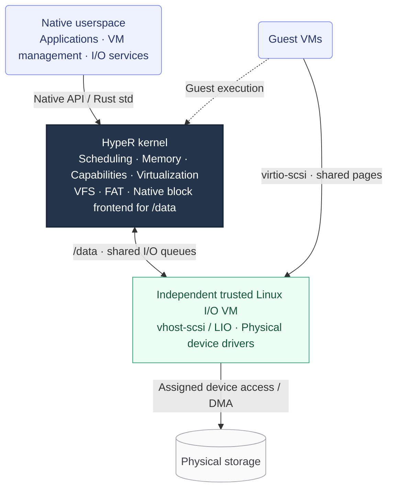

<!--
SPDX-FileCopyrightText: 2026 roolrz
SPDX-License-Identifier: Apache-2.0
-->

# HypeR

[](https://github.com/roolrz/HypeR/actions/workflows/ci.yml)
[](LICENSE)

<p align="center">
  
</p>

**An experimental virtualization host built around a Rust kernel and a native
capability-based userspace.**

HypeR owns the scheduler, memory management, hardware virtualization, and host
service runtime. Native userspace services manage Linux guests through explicit
capabilities. AArch64 is the primary platform and requires FEAT_VHE (Virtualization
Host Extensions).

## Architecture



**One I/O backend serves both HypeR and its guests.** Native file access to
`/data` goes through the kernel VFS and Native block frontend; guest disks use
virtio-scsi. Both reach the independent, trusted Linux I/O VM through shared
memory. Native io-runtime configures the backend and mounts `/data`.

Both business guests and the Linux I/O VM execute under the HypeR kernel.
Native VM management services control their lifecycles through capabilities;
Linux is an I/O backend, not the host kernel.

**Keep device drivers outside the HypeR kernel whenever practical.** An
independent Linux I/O VM supplies the main physical I/O backend. HypeR Native
userspace drivers can also access authorized devices and expose services to
applications. The kernel retains essential platform drivers and the mechanisms
for access control, interrupts, DMA and safe resource retirement; adding a
physical device driver to it requires a concrete reason. VFS remains in the
kernel. The selected I/O VM interfaces are **virtio-scsi** for storage,
**virtio-net** for networking, and **vfio-user** for general device backends.
Storage is implemented today; virtio-net and vfio-user are planned. Other
device models are evaluated case by case, without a general support commitment.
See the [architecture boundaries](kernel/docs/architecture.md#device-driver-placement)
and [I/O VM design](docs/io-vm.md) for details.

## Why run HypeR?

Run HypeR if you want to explore how a virtualization host is built, from CPU
entry to VM management, and change those layers together:

- **Control the whole host.** Work on the kernel, Native ABI, SDK, and VM
  services in one source tree, with ownership and lifecycle contracts across
  their boundaries.
- **Experiment with capability-based VM management.** Native services receive
  explicit handles and rights; a userspace VM manager delegates work to
  separate per-VM runtime processes. You can study and extend how authority is
  granted, narrowed, and retired.
- **Develop an AArch64-first Rust system.** Exercise the kernel and Native
  service stack in QEMU, with repeatable acceptance tests for SMP and Linux
  guest execution.

Today, the reason to choose HypeR is to develop this architecture. It is not
ready to host production or untrusted workloads, and the project makes no
claim of better performance or stronger security than established alternatives.

## What works today?

The AArch64 QEMU system boots Native init, a shell, and VM management services
with a resident Linux I/O VM, a persistent `/data` filesystem, and configurable
Linux guests with console access. RISC-V runs Native init,
shell, std applications, and userspace-managed Linux guests on QEMU. x86-64 currently has build and image validation only.

Pi 5 D0 hardware has booted the Native shell and Linux I/O VM, and read its
SD-backed FAT volume through `/data`. A two-vCPU Alpine guest has passed CPU
off/on cycles, reboot with file persistence, and poweroff on hardware. Write
durability, networking and device-reset recovery remain under qualification.

The Native ABI is pre-release. Broad hardware support, general-purpose virtual
I/O, device assignment, and transactional multi-vCPU reconfiguration remain unfinished.
See [implementation status](docs/status.md) and the [roadmap](docs/roadmap.md).

## Near-term roadmap

**Run HypeR on Raspberry Pi 5 with a trimmed, trusted Linux I/O VM as its
network and block-device backend.** Linux drives the physical devices; HypeR
Native services remain the host application runtime. Storage uses standard
virtio-scsi with Linux vhost-scsi/LIO.

- [x] Implement host GICv2 and Pi 5 debug-UART support; validate in QEMU.
- [x] Boot the Native shell on Pi 5 with four CPUs, timer and debug-UART input.
- [x] Add GICv2 guest interrupts, Arm guest SMP and runtime-managed guest power control.
- [x] Validate guest SMP, CPU hotplug, reboot and poweroff on Pi 5 (two-vCPU Alpine).
- [x] Boot the Linux I/O VM on physical Pi 5 and reach Linux userspace.
- [x] Publish the complete appliance from [HypeR-io-vm](https://github.com/roolrz/HypeR-io-vm)
  and consume a digest-pinned package; HypeR owns apps and DTS/DTB.
- [x] Verify cross-VM virtio-scsi/vhost I/O against a real QEMU disk.
- [x] Mount and read the SD-backed configuration volume through the Pi 5 I/O VM.
- [ ] Qualify storage writes, durability and DMA retirement; add the network-controller path.
- [ ] Exercise Native network and storage I/O on Pi 5, including failure handling
  and performance measurements.

See the [roadmap](docs/roadmap.md) for scope and acceptance criteria, and the
[Pi 5 boot guide](kernel/docs/rpi5.md) for the recommended firmware setup.

## Try it

**Raspberry Pi 5:** download a prebuilt image from
[HypeR Pi 5 releases](https://github.com/roolrz/HypeR-pi5-images/releases).
Decompress the whole-disk `.img.xz` and flash the resulting `.img` to an SD card.
See the [artifact guide](https://github.com/roolrz/HypeR-pi5-images/blob/main/ARTIFACTS.md)
to choose an image, the [Pi 5 boot guide](kernel/docs/rpi5.md) for serial-console
setup, and [image distribution](docs/image-distribution.md) for build and licensing details.

**QEMU:** build and run locally with the commands below.
With the [prerequisites](docs/getting-started.md#prerequisites) installed, run
from the repository root:

```sh
make defconfig
make
make run
```

This boots the AArch64 system with the HypeR shell and a resident Linux I/O VM
in QEMU. The first build downloads pinned assets and creates a persistent board
disk; `make run` launches those existing artifacts without building them; HypeR mounts its configuration volume at `/data`. The default guest is
available through `vmm start alpine`. See [board storage](docs/board-storage.md)
and [getting started](docs/getting-started.md) for configuration and build targets.

## Explore and contribute

- [Reading the code](docs/reading-the-code.md): a contributor’s guide to code paths,
  subsystem ownership, debugging and tests—from boot and scheduling to memory,
  IPC, virtualization, storage and image packaging.
- [Development guide](docs/development.md): editor setup, testing, source layout,
  and contribution requirements.
- [Architecture](kernel/docs/architecture.md): kernel boundaries and ownership.
- [Pi 5 image distribution](docs/image-distribution.md): image builds, release
  artifacts, dependency pins, and component licensing.
- [Shell and text filtering](docs/shell.md): pipelines, file redirection, and grep.
- [Native userspace](kernel/docs/native-init.md) and [SDK](sdk/README.md): host
  services and application interfaces.
- [Issues](https://github.com/roolrz/HypeR/issues): bugs, experiments, and design
  discussions. Architecture work, tests, and rigorous reviews are welcome.

[Apache-2.0](LICENSE). External guest images have [separate licensing obligations](docs/development.md#guest-artifacts-and-licensing).
For vulnerability reporting, see [SECURITY.md](SECURITY.md).
