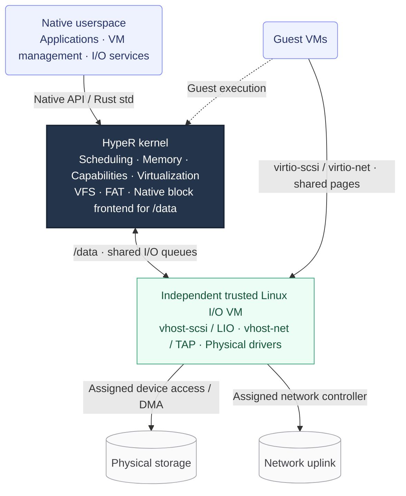

<!--
SPDX-FileCopyrightText: 2026 roolrz
SPDX-License-Identifier: Apache-2.0
-->

# HypeR

[](https://github.com/roolrz/HypeR/actions/workflows/ci.yml)
[](LICENSE)

<p align="center">
  
</p>

**An experimental virtualization host built around a Rust kernel and a native
capability-based userspace.**

HypeR owns the scheduler, memory management, hardware virtualization, and host
service runtime. Native userspace services manage Linux guests through explicit
capabilities. AArch64 is the primary platform and requires FEAT_VHE (Virtualization
Host Extensions).

## Architecture


```mermaid
flowchart TB
    Apps("Native userspace<br/>Applications · VM management · I/O services")
    Guests("Guest VMs")

    Kernel["HypeR kernel<br/>Scheduling · Memory · Capabilities · Virtualization<br/>VFS · FAT · Native block frontend for /data"]
    IO["Independent trusted Linux I/O VM<br/>vhost-scsi / LIO · vhost-net / TAP · Physical drivers"]
    Disk[("Physical storage")]
    Net[("Network uplink")]

    Apps -->|Native API / Rust std| Kernel
    Guests -.->|Guest execution| Kernel
    Guests -->|virtio-scsi / virtio-net · shared pages| IO
    Kernel <-->|/data · shared I/O queues| IO
    IO -->|Assigned device access / DMA| Disk
    IO -->|Assigned network controller| Net

    classDef client fill:#eef2ff,stroke:#818cf8,color:#273469
    classDef kernel fill:#24354b,stroke:#182638,color:#ffffff,stroke-width:2px
    classDef backend fill:#ecfdf5,stroke:#34a375,color:#14543b
    classDef device fill:#fafafa,stroke:#a1a1aa,color:#3f3f46
    class Apps,Guests client
    class Kernel kernel
    class IO backend
    class Disk,Net device
```

**One I/O backend serves both HypeR and its guests.** Native file access to
`/data` goes through the kernel VFS and Native block frontend; guest disks use
virtio-scsi. Guest networking uses virtio-net through the same trusted Linux
I/O VM, which automatically bridges each guest TAP to the configured uplink.
Native io-runtime owns the shared-memory bindings and mounts `/data`.
HypeR Native reserves a future network endpoint without establishing a link.

Both business guests and the Linux I/O VM execute under the HypeR kernel.
Native VM management services control their lifecycles through capabilities;
Linux is an I/O backend, not the host kernel.

**Keep device drivers outside the HypeR kernel whenever practical.** An
independent Linux I/O VM supplies the main physical I/O backend. HypeR Native
userspace drivers can also access authorized devices and expose services to
applications. The kernel retains essential platform drivers and the mechanisms
for access control, interrupts, DMA and safe resource retirement; adding a
physical device driver to it requires a concrete reason. VFS remains in the
kernel. The selected I/O VM interfaces are **virtio-scsi** for storage,
**virtio-net** for networking, and **vfio-user** for general device backends.
Storage and guest virtio-net have passed QEMU functional acceptance, including
network reset and VM restart. vfio-user remains planned. Other device models are
evaluated case by case, without a general support commitment.
See the [architecture boundaries](kernel/docs/architecture.md#device-driver-placement)
and [I/O VM design](docs/io-vm.md) for details.

## Why run HypeR?

Run HypeR if you want to explore how a virtualization host is built, from CPU
entry to VM management, and change those layers together:

- **Control the whole host.** Work on the kernel, Native ABI, SDK, and VM
  services in one source tree, with ownership and lifecycle contracts across
  their boundaries.
- **Experiment with capability-based VM management.** Native services receive
  explicit handles and rights; a userspace VM manager delegates work to
  separate per-VM runtime processes. You can study and extend how authority is
  granted, narrowed, and retired.
- **Develop an AArch64-first Rust system.** Exercise the kernel and Native
  service stack in QEMU, with repeatable acceptance tests for SMP and Linux
  guest execution.

Today, the reason to choose HypeR is to develop this architecture. It is not
ready to host production or untrusted workloads, and the project makes no
claim of better performance or stronger security than established alternatives.

## What works today?

The AArch64 QEMU system boots Native init, a shell, and VM management services
with a resident Linux I/O VM, a persistent `/data` filesystem, and configurable
Linux guests with console access. The default deployment provides guest
DHCP and outbound HTTP through the I/O VM, validated with GICv2 and GICv3.
RISC-V runs Native init,
shell, std applications, and userspace-managed Linux guests on QEMU. x86-64 currently has build and image validation only.

Pi 5 D0 hardware has booted the Native shell and Linux I/O VM. The combined
SDIO1/RP1 deployment has completed 1 GiB Native FAT and Alpine ext4 writes with
full readback checks, plus bidirectional guest TCP measurements through RP1.
Earlier two-vCPU Alpine tests passed CPU off/on cycles, reboot with file
persistence, and poweroff. Power-loss durability, concurrent I/O stress and
physical device retirement/recovery still require hardware qualification.

The Native ABI is pre-release. Broad hardware support, general-purpose virtual
I/O, device assignment, and transactional multi-vCPU reconfiguration remain unfinished.
See [implementation status](docs/status.md) and the [roadmap](docs/roadmap.md).

## Exploratory Pi 5 I/O measurements

**2026-10-06: an initial performance survey, for reference only.** This was an
informal development setup, not a controlled benchmark. Each case was run once;
card identity/state, filesystem and mount settings, available RAM, thermal/clock
conditions and network filtering were not fully standardized or recorded. These
numbers compare complete deployments, not isolated hypervisor overhead, and do
not establish production readiness or power-loss durability.

The tests used physical Raspberry Pi 5 hardware and separate SD cards for HypeR
and native Raspbian. HypeR Native accessed FAT32 at `/data`; Alpine accessed its
ext4 root disk through virtio-scsi and the Linux I/O VM. Raspbian used its existing
filesystem. Alpine had two vCPUs and 256 MiB RAM; the I/O VM had one vCPU and
128 MiB. The HypeR test image was based on `b7022b6` with local test fixtures and
the digest-pinned Pi 5 appliance from I/O VM source `c8ec02adbb8f`.

Storage used the same deterministic **1 GiB** workload: 128 KiB sequential
writes followed by a volume sync. Throughput and total time include the sync;
full readback verification follows outside the timed interval. All Native,
guest and Raspbian sequential write/readback checks passed. The 4 KiB case used
128 overwrites with a volume sync after every write, at application queue depth
one; its IOPS are synchronous-write IOPS, not ordinary buffered or raw-disk IOPS.

| Storage measurement | Native Raspbian | HypeR Native | Alpine guest on HypeR |
| --- | ---: | ---: | ---: |
| New-file sequential write (MiB/s) | 24.76 | 8.82 | 23.34 |
| New-file write total (s) | 41.36 | 116.13 | 43.87 |
| Existing-file overwrite (MiB/s) | 25.48 | 14.35 | 23.09 |
| Overwrite total (s) | 40.19 | 71.37 | 44.34 |
| 4 KiB write + volume sync (IOPS) | 175.54 | 103.60 | 93.07 |
| Synchronous-write mean latency (ms) | 5.70 | 9.65 | 10.74 |
| Synchronous-write P95 latency (ms) | 13.00 | 12.44 | 12.18 |
| Synchronous-write P99 latency (ms) | 32.60 | 12.47 | 23.42 |

For networking, the same Mac ran iperf3 3.22 as the client, with Raspbian or the
Alpine guest as the server. Alpine ran Linux `6.18.36-0-virt` and iperf3 3.19.1.
Each TCP case used a 2-second warm-up and a 15-second measurement, with one or
four connections. Values are aggregate receiver-reported decimal Mbit/s.
Mac-to-Pi connections and their return traffic were permitted by the network
policy. The peer, network path and filtering are part of these measurements.

| TCP direction | Connections | Native Raspbian (Mbit/s) | Alpine guest (Mbit/s) | Guest / Raspbian |
| --- | ---: | ---: | ---: | ---: |
| Mac -> Pi | 1 | 926.99 | 843.29 | 91.0% |
| Mac -> Pi | 4 | 926.25 | 817.71 | 88.3% |
| Pi -> Mac | 1 | 935.89 | 296.69 | 31.7% |
| Pi -> Mac | 4 | 934.78 | 287.53 | 30.8% |

HypeR Native networking is not implemented and was not measured. Storage and
network tests ran separately; concurrent load and fault tests are still pending.
The [storage procedure](tests/hardware/storage/README.md) and
[network exercise](tests/hardware/network/README.md) describe the tools and
collection commands. These are manual hardware measurements, not QEMU results
or CI performance thresholds. Default builds and images do not compile or
package the measurement tools; the explicit preparation scripts create
separate test images.

## Near-term roadmap

Basic Pi 5 bring-up, Native and guest storage, guest networking, and the first
performance survey are complete. The next priorities are:

- [ ] **Block and guest network performance tuning, on a best-effort basis.**
  Measure and reduce overhead with focused changes, without major code or
  architecture rework. Start with Native storage writes and guest network
  transmit throughput, using the physical Pi 5/Raspbian survey as a reference.
  Linux parity is not an acceptance requirement; performance tests stay manual.
- [ ] **Security hardening around the I/O VM.** Refine capabilities into finer
  device, resource and operation permissions. Add host-owned SMMU/IOMMU drivers
  and DMA domains, including the applicable RP1/BCM2712 isolation mechanisms.
  Establish coverage for each assigned device, including the separate SDHCI
  path. The goal is to protect HypeR memory and authority from the I/O VM;
  guests still depend on it for I/O. The current Pi 5 deployment remains a
  trusted I/O VM configuration until that isolation is implemented and verified.

See the [roadmap](docs/roadmap.md) for scope and acceptance criteria, and the
[Pi 5 boot guide](kernel/docs/rpi5.md) for the recommended firmware setup.

## Try it

**Raspberry Pi 5:** download a prebuilt image from
[HypeR Pi 5 releases](https://github.com/roolrz/HypeR-pi5-images/releases).
Decompress the whole-disk `.img.xz` and flash the resulting `.img` to an SD card.
See the [artifact guide](https://github.com/roolrz/HypeR-pi5-images/blob/main/ARTIFACTS.md)
to choose an image, the [Pi 5 boot guide](kernel/docs/rpi5.md) for serial-console
setup, and [image distribution](docs/image-distribution.md) for build and licensing details.

**QEMU:** build and run locally with the commands below.
With the [prerequisites](docs/getting-started.md#prerequisites) installed, run
from the repository root:

```sh
make defconfig
make
make run
```

The build imports the matching protocol version 3 appliance from the committed
GHCR digest pin. See [I/O VM build and validation](docs/io-vm.md#build-and-validation)
for package verification and the `boards/qemu.json` deployment.

This boots the AArch64 system with the HypeR shell and a resident Linux I/O VM
in QEMU. The first build downloads pinned assets and creates a persistent board
disk; `make run` launches those existing artifacts without building them.
HypeR mounts its configuration volume at `/data`. Start the default guest with
`vmm start alpine`; Alpine enables its network interface and starts DHCP
automatically. Later builds preserve on-disk VM definitions, guest images and
root filesystems; see [updating existing deployments](docs/board-storage.md#updating-existing-deployments)
when adopting changed board policy or guest startup files.

## Explore and contribute

- [Reading the code](docs/reading-the-code.md): a contributor’s guide to code paths,
  subsystem ownership, debugging and tests—from boot and scheduling to memory,
  IPC, virtualization, storage and image packaging.
- [Development guide](docs/development.md): editor setup, testing, source layout,
  and contribution requirements.
- [Architecture](kernel/docs/architecture.md): kernel boundaries and ownership.
- [Pi 5 image distribution](docs/image-distribution.md): image builds, release
  artifacts, dependency pins, and component licensing.
- [Shell and text filtering](docs/shell.md): pipelines, file redirection, and grep.
- [Native userspace](kernel/docs/native-init.md) and [SDK](sdk/README.md): host
  services and application interfaces.
- [Issues](https://github.com/roolrz/HypeR/issues): bugs, experiments, and design
  discussions. Architecture work, tests, and rigorous reviews are welcome.

[Apache-2.0](LICENSE). External guest images have [separate licensing obligations](docs/development.md#guest-artifacts-and-licensing).
For vulnerability reporting, see [SECURITY.md](SECURITY.md).
