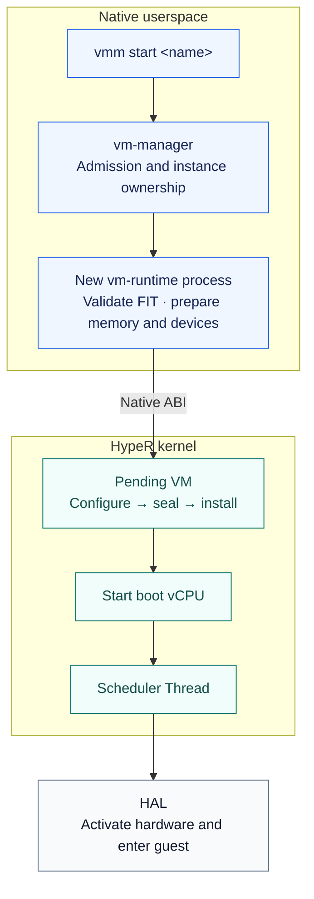
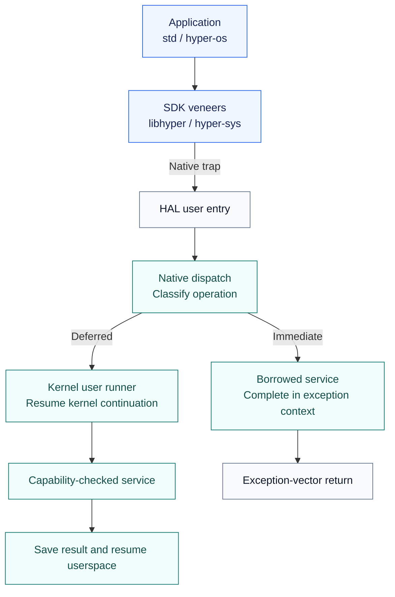
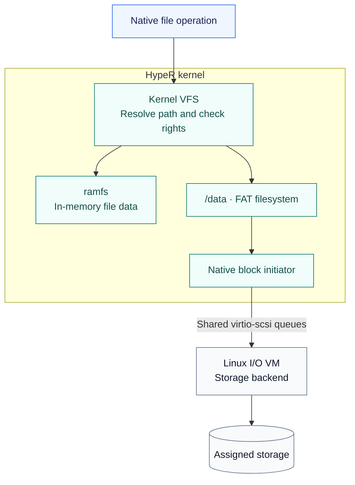
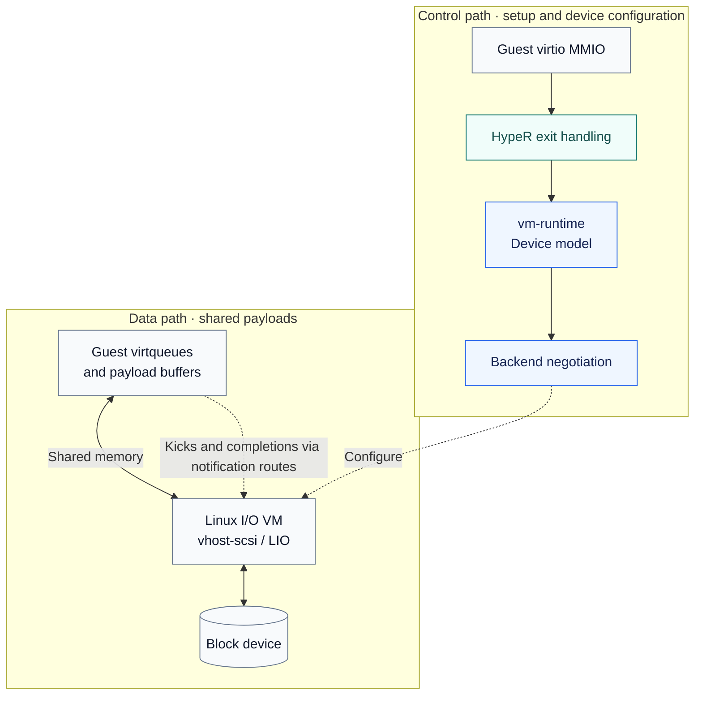
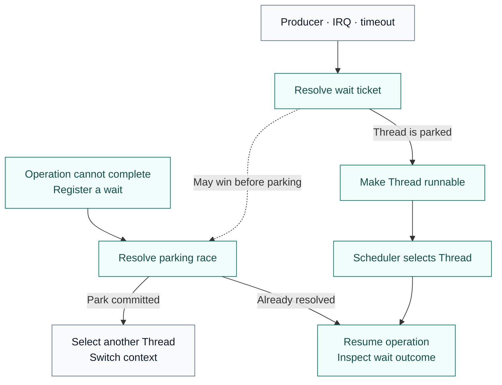
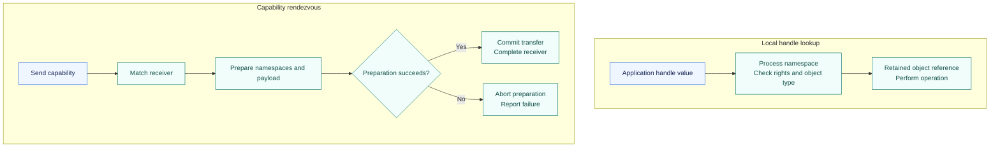
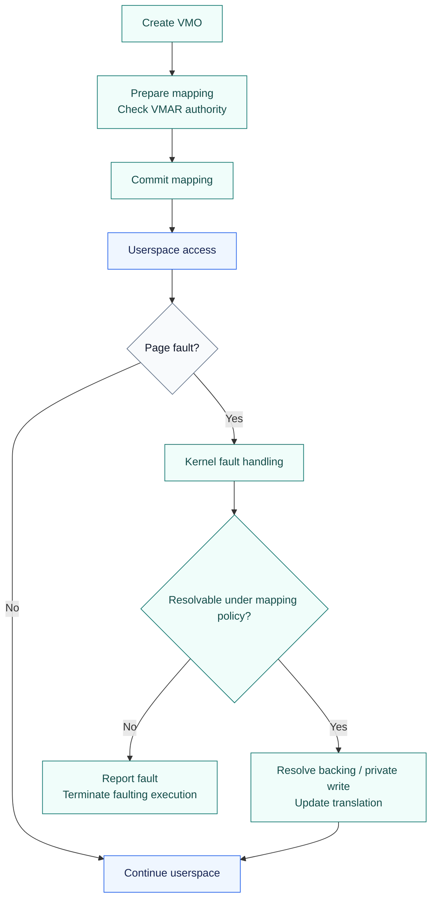
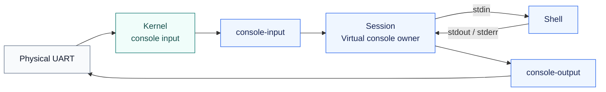
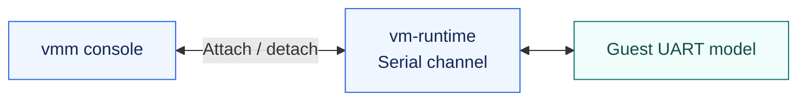

<!--
SPDX-FileCopyrightText: 2026 roolrz
SPDX-License-Identifier: Apache-2.0
-->

# Reading the code

This guide follows common operations from their public entry points to the
owners that perform them. Start with one operation and its tests, rather than
reading every module in directory order. The architecture-specific examples
use AArch64, HypeR's primary architecture; RISC-V shares kernel policy but has
its own entry and translation mechanisms.

The arrows below describe responsibility and execution flow. They are not all
direct function calls: channels, syscall continuations, scheduler handoffs and
shared queues cross several of these boundaries.

Diagrams use blue for application/service code, teal for kernel policy and
state, and slate for hardware or guest/backend boundaries. Solid arrows show
the main flow; dashed arrows show coordination or notifications. Color is only
a reading aid—the node labels identify the actual owners.

## Choose a path

- [Boot to the first application](#1-boot-to-the-first-application)
- [Creating and starting a VM](#2-creating-and-starting-a-vm)
- [Guest exceptions, MMIO and interrupts](#3-guest-exceptions-mmio-and-interrupts)
- [Native syscalls](#4-native-syscalls-from-an-application-back-to-its-thread)
- [Creating Processes and Threads](#5-creating-processes-and-threads)
- [Native files: ramfs and /data](#6-native-file-access-ramfs-versus-data)
- [Guest disk service through the I/O VM](#7-how-the-io-vm-serves-a-guest-disk)
- [Teardown and tests](#8-follow-teardown-and-tests-before-changing-a-path)
- [Scheduling, blocking and waking](#9-scheduling-blocking-and-waking-a-thread)
- [Object waits, WaitSet and atomic waits](#10-object-waits-waitset-and-futex-style-atomic-waits)
- [Handles, rights and IPC](#11-handles-rights-and-ipc-transfer)
- [Mappings, private writes and translation IDs](#12-native-mappings-private-writes-and-translation-identifiers)
- [Consoles and shell lifetime](#13-console-input-shell-lifetime-and-guest-attachment)
- [Configuration, services and packaging](#14-from-configuration-to-a-running-service-or-disk-image)
- [First contributions and validation](#15-picking-a-first-contribution-and-validating-it)

## First orientation

| Area | Start here | Responsibility |
| --- | --- | --- |
| Boot | [kernel main](../kernel/src/main.rs) | Explicit initialization order and Native init startup |
| Kernel policy | [kernel modules](../kernel/src/kernel/mod.rs) | Processes, scheduling, capabilities, VFS and installed VMs |
| Hardware mechanisms | [HAL](../kernel/hal/src/hal/vm.rs), [AArch64 backend](../kernel/hal/src/arch/aarch64/mod.rs) | Hardware state and architecture-specific execution |
| Reusable mechanisms | [core library](../kernel/src/lib.rs) | Formats, interrupt models, memory and synchronization algorithms |
| Native ABI | [ABI schema](../sdk/abi/schema/native.rs) | Wire layout and generated Rust/C/reference definitions |
| Applications | [application guide](../app/README.md) | Init, shell, VM management and I/O services |

`kernel/core` builds the reusable library from `kernel/src/lib.rs`.
`kernel/hal` includes the selected architecture backend and depends on that
library; it does not depend on the kernel binary. An upward transition uses an
explicit registered entry/service boundary. See the
[architecture contract](../kernel/docs/architecture.md) for the rules behind
this arrangement.

## 1. Boot to the first application

Read [boot.S](../kernel/hal/src/arch/aarch64/boot.S), then the
[AArch64 bootstrap](../kernel/hal/src/arch/aarch64/mod.rs), then
[kernel main](../kernel/src/main.rs). Assembly handles the initial execution
environment; the common startup sequence establishes memory, scheduling,
interrupts, time and platform/VM services before publishing userspace.

[Kernel init](../kernel/src/kernel/init/mod.rs) loads `/init` and prepares its
initial capabilities. [Native init runtime](../app/init/src/runtime.rs) consumes
the service manifest and supervises services. The virtual console manager in
[session](../app/session/src/main.rs) starts the shell after the console exists
and can restart it after exit. A shell is not itself a boot-critical service.

For image contents and launch commands, use the
[getting-started guide](getting-started.md) and
[application deployment manifest](../app/deployment.json). A runtime failure
and a stale packaged image are different debugging problems.

## 2. Creating and starting a VM

1. [vmm](../app/vmm/src/main.rs) parses the command and sends a management
   request. [vm-manager](../app/vm-manager/src/main.rs), especially
   `start_instance`, owns the named definition, resource policy and per-instance
   runtime process. Start with the manager when investigating admission errors.
2. [vm-runtime `run`](../app/vm-runtime/src/main.rs) validates the image, prepares
   its memory and serial channel, creates a pending VM, attaches memory and
   bootstrap information, seals it, installs it and starts the boot vCPU.
   [vm-support](../app/vm-support/src/lib.rs) contains shared loading/device
   mechanisms; [SDK VM bindings](../sdk/rust/hyper-os/src/vm.rs) expose the Native
   operations used here.
3. [VM services](../kernel/src/kernel/vm/service.rs) resolve capabilities and
   implement `create_pending`, `seal`, `install` and `start_vcpu`.
   [Pending objects](../kernel/src/kernel/vm/objects/pending.rs),
   [installed ownership](../kernel/src/kernel/vm/installed.rs) and
   [registry construction](../kernel/src/kernel/vm/registry/construction.rs)
   separate preparation from publication and execution ownership.
4. [The vCPU runner](../kernel/src/kernel/vm/vcpu/runner.rs) is a scheduler Thread.
   [Transitions](../kernel/src/kernel/vm/vcpu/transition.rs) acquire execution
   ownership and activate hardware through the HAL before guest entry.

Creation, installation and execution are separate steps. Receiving a successful
start reply does not mean the guest has reached its kernel entry or userspace.
See [VM image and boot ownership](../kernel/docs/vm-bundle.md).

**Debugging a VM stuck in `starting`:** locate the last completed boundary:
image validation, memory preparation, backend setup, VM installation or vCPU
submission. Read the manager's state handling together with runtime reports;
a state label alone does not identify which subsystem is waiting. For a failure
after submission, use the kernel's vCPU stop reason and the guest console rather
than retrying image loading blindly.

**Secondary CPUs:** starting the boot vCPU is not the same as starting every
configured vCPU. Follow guest PSCI actions through the exception path below
and runtime control handling. Keep configured capacity, created vCPU handles
and executing vCPUs distinct when reading status output.

## 3. Guest exceptions, MMIO and interrupts

Start with [vectors.S](../kernel/hal/src/arch/aarch64/vectors.S) and
[exception.rs](../kernel/hal/src/arch/aarch64/exception.rs). They preserve the
machine frame, classify the exception and encode the eventual return. Then
follow the selected case:

| Guest event | Follow this code | What happens |
| --- | --- | --- |
| System register, WFI, PSCI | [vsysreg.rs](../kernel/hal/src/arch/aarch64/vsysreg.rs) | Decode owned exit facts and produce an explicit action: resume, wait, stop or deferred completion |
| Device MMIO | [kernel device dispatch](../kernel/src/kernel/vm/device/aarch64.rs) | Handle kernel-owned devices or route an admitted request to userspace |
| GIC registers | [GIC service](../kernel/src/kernel/vm/device/gic.rs), [VM interrupt controller](../kernel/hal/src/arch/aarch64/vm_interrupt.rs) | Decode access, synchronize hardware state and update the virtual interrupt model |
| Guest memory fault | [guest memory owner](../kernel/src/kernel/vm/memory.rs), [stage-2 backend](../kernel/hal/src/arch/aarch64/stage2.rs) | Resolve admitted guest backing and translation faults; reject accesses outside policy |
| Host IRQ while a guest runs | [IRQ entry](../kernel/src/kernel/entry/irq.rs), [VM timer/maintenance integration](../kernel/src/kernel/vm/timer.rs) | Dispatch the host interrupt, reconcile virtual delivery and schedule through the guest IRQ postlude when required |

For a deferred device access, continue in
[the vCPU runner](../kernel/src/kernel/vm/vcpu/runner.rs) and
[MMIO continuation](../kernel/src/kernel/vm/vcpu/mmio.rs). Hardware is detached
before the Thread parks; a completion updates the saved instruction before
re-entry. A userspace device request and an internal GIC synchronization request
share a device-wait disposition but have different completion owners.

For vGIC work, read the reusable
[controller](../kernel/src/vm/arm/gic/controller.rs) and
[quiesce model](../kernel/src/vm/arm/gic/quiesce.rs) alongside the hardware
[save/restore backend](../kernel/hal/src/arch/aarch64/vgic.rs).
The model's saved state and a running CPU's LR state are not interchangeable.
The runtime [bank guard](../kernel/hal/src/arch/aarch64/vgic/bank.rs) tracks
whether cleanup should save live hardware or reuse an already saved snapshot.

**Following one exception:** record the exception class, guest PC, syndrome
and fault address, then find the matching dispatch branch. Determine whether
it produces an immediate frame update or an owned action completed after
hardware detachment. Follow that action to its consumer; the decoder alone
does not show the complete operation.

**When changing register emulation:** check read and write semantics separately,
including width, reserved fields and side effects. For GIC state, check the
case where an interrupt is represented in software and the case where it is
resident in a hardware LR on another CPU. Do not treat a saved model snapshot
as a fresh read of remote hardware.

## 4. Native syscalls: from an application back to its Thread

The SDK has both C and Rust syscall veneers; follow the actual caller rather
than assuming every Rust operation passes through C.
[The ABI schema](../sdk/abi/schema/native.rs) is the starting point for a
syscall's arguments, rights and result format.

[HAL user entry](../kernel/hal/src/arch/aarch64/user_entry.rs) handles the machine
boundary. [The kernel user runner](../kernel/src/kernel/entry/user.rs) owns the
Process/Thread execution context and the return/deferred-call protocol.
Immediate calls can return through the exception vector using a borrowed
service; deferred calls resume the ordinary kernel continuation.
[Native dispatch](../kernel/src/kernel/abi/native/dispatch.rs) classifies calls;
[handlers](../kernel/src/kernel/abi/native/handlers.rs) and
[filesystem handlers](../kernel/src/kernel/abi/native/fs_handlers.rs) decode
requests against service contracts. [Process services](../kernel/src/kernel/entry/services.rs)
bind those contracts to the current Process, handles and user memory.

Calls classified as deferred run after leaving the restricted user execution
context, where the kernel can perform the required scheduled work. Do not add
an allocating or blocking operation to the immediate path merely because its
handler is short. For usercopy, follow the service's user-memory helpers into
[the address-space owner](../kernel/src/kernel/mm/user_space/address_space.rs),
not an assumed global `copy_from_user` function.

**Adding or changing a syscall:** trace schema → generated bindings → dispatch
classification → handler → service owner → SDK/std caller. An error needs to
survive that return path with its meaning intact. Changing only the handler
can leave the published ABI or application adapter describing the old contract.
The syscall reference and generated-code checks are part of validation.

## 5. Creating Processes and Threads

A new Process and a new Thread in an existing Process are different operations.
Both eventually publish scheduler-owned Threads, but only Process creation
loads a new image and address space.

- **Process:** [std process adapter](../sdk/toolchain/rust-std/overlay/std/src/sys/process/hyper.rs)
  and [libhyper process adapter](../sdk/lib/src/std-process.c), or an explicit
  [SDK ProcessBuilder](../sdk/rust/hyper-os/src/task.rs), lead through Native
  dispatch to [the kernel builder](../kernel/src/kernel/process/builder.rs).
  Follow `start_process_builder`, [the loader](../kernel/src/kernel/process/loader.rs),
  [Process owner](../kernel/src/kernel/process/owner.rs) and
  [startup publication](../kernel/src/kernel/process/owner/start.rs).
  Image loading, capability delegation and making the initial Thread runnable
  have distinct failure/rollback boundaries.
- **Additional Thread:** [std thread adapter](../sdk/toolchain/rust-std/overlay/std/src/sys/thread/hyper.rs)
  uses [thread_spawn.c](../sdk/lib/src/thread_spawn.c). Native `thread_create`
  reaches `create_thread` in [Process services](../kernel/src/kernel/entry/services.rs),
  which validates start information and affinity and asks the Process owner to
  prepare the user Thread. Creation and `thread_start` are separate operations.
  [UserThread](../kernel/src/kernel/process/user_thread.rs) and
  [scheduler Thread](../kernel/src/kernel/task/thread.rs) serve different ownership roles.
- **Stack:** [stack.c](../sdk/lib/src/stack.c) manages guarded reservations and
  explicit growth for both the runtime-created main stack and SDK-created worker stacks.
  [Runtime initialization](../sdk/lib/src/runtime.c) copies startup data;
  [bootstrap handoff](../sdk/lib/src/bootstrap.c) builds the final entry vector,
  switches to the final stack and only then releases the kernel bootstrap reservation.
  See [stack APIs](../sdk/lib/README.md#guarded-growable-stacks) before changing
  stack size or cleanup. A userspace stack is separate from its kernel stack.

**Where the new Thread's SP comes from:** `hyper_runtime_thread_spawn_with_stack`
creates the stack and obtains its address information with `hyper_stack_get_info`.
It passes `info.top` as the `initial_sp` argument of `hyper_thread_create`, with
`worker` as the entry and the user-heap token pointer as the entry argument.
The kernel does not dereference that token to discover the stack. The Process
owner passes the supplied SP into `hal::user::prepare_context`;
[AArch64 user context construction](../kernel/hal/src/arch/aarch64/user_entry.rs)
stores it in `MachineContext.stack_pointer`. When the scheduled Thread enters
userspace, `aarch64_run_native_user` in
[context.S](../kernel/hal/src/arch/aarch64/context.S) explicitly loads that field,
writes `SP_EL0`, and executes `eret` after restoring the remaining user state.
`worker` therefore starts on its final stack; it does not perform another stack
switch. Its `hyper_runtime_thread_attach_stack` call only associates the stack
descriptor with the per-thread SDK state in [thread.c](../sdk/lib/src/thread.c).

**Who reclaims it:** the SDK starts one process-lifetime reaper lazily on the
first runtime thread spawn. It waits for kernel `THREAD_TERMINATED` events,
removes subscriptions, and reclaims detached threads. Joinable threads retain
their token, handle and stack until `join` or release consumes them. This is a
user thread, separate from the kernel's object reaper. The terminating worker
cannot unmap its own live stack. Normal worker return runs TLS cleanup before
`thread_exit`; a raw exit or stop can bypass that cleanup, although the termination
event still allows the SDK to reclaim the stack. Runtime stack growth is explicit
and bounded by the capacity reserved at creation, not automatic fault-driven growth.

## 6. Native file access: ramfs versus `/data`

Start with [std fs](../sdk/toolchain/rust-std/overlay/std/src/sys/fs/hyper.rs),
[std-fs.c](../sdk/lib/src/std-fs.c), then Native filesystem dispatch.
[Kernel VFS services](../kernel/src/kernel/vfs/service.rs) and
[entry adapters](../kernel/src/kernel/entry/services/vfs.rs) enforce capability
rights, copy payloads and invoke the VFS objects.
[Path resolution](../kernel/src/kernel/vfs/resolve.rs) follows the delegated
root/cwd and mounts; [backend selection](../kernel/src/kernel/vfs/instance.rs)
determines the remaining path.

For ramfs, read [the VFS adapter](../kernel/src/kernel/vfs/ramfs.rs) and
[ramfs implementation](../kernel/src/fs/ramfs.rs).
For `/data`, read [the FAT adapter](../kernel/src/kernel/vfs/fat.rs),
[block interface](../kernel/src/fs/block.rs),
[Native block owner](../kernel/src/kernel/block/mod.rs),
[request lifecycle](../kernel/src/kernel/block/request.rs) and
[queue wire format](../kernel/src/kernel/block/wire.rs).

[io-runtime `managed.rs`](../app/io-runtime/src/managed.rs) negotiates the
configuration-volume client and its dedicated shared pool;
[runtime.rs](../app/io-runtime/src/runtime.rs) mounts it and publishes readiness.
Once established, individual filesystem requests use the kernel block queues
and notifications directly. io-runtime is not a userspace relay for each read
or write. VFS and FAT remain in HypeR's kernel; the Linux backend supplies block
storage, not pathname lookup. Consult [FAT semantics](../kernel/docs/fat.md)
for differences from ramfs.

**Following a write:** separate acceptance by the file operation, completion of
the block request and persistence guarantees. Inspect the backend's sync/flush
implementation before assigning durability semantics to a successful write.
Likewise, a short read or write is an API result to propagate or retry according
to the caller's contract, not automatically evidence of a corrupt disk.

**Debugging `/data`:** first establish that io-runtime published mount readiness.
Then distinguish path lookup/permissions, FAT metadata handling, queue submission
and backend completion. Guest disk success does not by itself prove that the
Native configuration-volume client is healthy; they are different clients.

## 7. How the I/O VM serves a guest disk

Keep the control and data paths separate:

Read [vm-runtime disk setup](../app/vm-runtime/src/disk.rs),
[virtio-scsi device model](../app/vm-support/src/virtio_scsi.rs) and
[asynchronous backend control](../app/vm-support/src/io_backend.rs).
[The runtime control loop](../app/vm-runtime/src/control.rs) services deferred
MMIO and backend replies without holding the vCPU in a synchronous RPC.
The [I/O broker](../app/io-runtime/src/broker.rs) authorizes client sessions;
[broker exchange](../app/io-runtime/src/broker_exchange.rs) handles their control
traffic. [The protocol](../app/vm-support/src/io_protocol.rs) defines the
negotiation records.

Inside HypeR, [VM I/O services](../kernel/src/kernel/vm/io/service.rs),
[mailboxes](../kernel/src/kernel/vm/io/mailbox.rs) and
[notifications](../kernel/src/kernel/vm/io/notification.rs) implement the
capability-scoped communication and notification mechanisms. This does not
mean every data request becomes a vm-runtime MMIO round trip or that the path
uses no kernel transitions. Payload buffers are shared with the backend rather
than copied through a vm-runtime bounce buffer.

The Linux kernel, modules and appliance services live in the separate
[HypeR-io-vm repository](https://github.com/roolrz/HypeR-io-vm), not this tree.
[io-vm.lock.json](../scripts/io-vm.lock.json) selects the imported generation;
use its source revision when tracing the other side, rather than assuming the
other repository's latest main matches a local image.
[The I/O VM design](io-vm.md) explains queue ownership, eager shared-memory
backing, DMA constraints and the limits of the zero-copy claim.

## 8. Follow teardown and tests before changing a path

For VM exit, follow [installed lifecycle](../kernel/src/kernel/vm/installed.rs),
[vCPU lifecycle](../kernel/src/kernel/vm/vcpu/lifecycle.rs),
[registry control](../kernel/src/kernel/vm/registry/control.rs) and
[memory retirement](../kernel/src/kernel/vm/memory/retirement.rs).
For Native exit, start with `finish_native_call` in
[the user runner](../kernel/src/kernel/entry/user.rs), then the Process owner
and [scheduler](../kernel/src/kernel/task/scheduler/mod.rs).
Guest execution stopping, publishing a terminal state, releasing handles and
reclaiming hardware-backed storage are distinct events.

Useful checks to read beside these paths:

| Area | Tests |
| --- | --- |
| vGIC state and synchronization | [controller tests](../kernel/tests/host/src/cases/vgic.rs), [quiesce tests](../kernel/tests/host/src/cases/vgic_quiesce.rs) |
| VM ownership and trapped device operations | [vm-smoke](../app/vm-smoke/src/main.rs), [QEMU harness](../tests/qemu/verify-vm-smoke.py) |
| Guest SMP and power | [guest SMP harness](../tests/qemu/verify-guest-smp.py) |
| Native file and guest disk integration | [CI entry points](../tests/ci/run.sh): `board-storage` and `io-vm` |
| SDK stacks and thread cleanup | [stack tests](../sdk/lib/tests/unit/stack.c), [spawn tests](../sdk/lib/tests/unit/thread-spawn.c) |

Use [development](development.md) for commands and test prerequisites. A model
test can establish a transition invariant; QEMU checks integration. Neither
alone establishes physical-device DMA safety or every weak-memory ordering case.

## 9. Scheduling, blocking and waking a Thread

Read these in order:

1. [Scheduler public operations](../kernel/src/kernel/task/scheduler/mod.rs)
   connect kernel callers to the scheduler. `kthread_create` is a useful entry
   for kernel workers; Native and vCPU Threads have their own prepared startup
   objects. Follow the specific caller rather than treating all creation paths
   as identical.
2. [Scheduler state](../kernel/src/kernel/task/scheduler/state.rs) and
   [queues](../kernel/src/kernel/task/scheduler/queue.rs) decide where a Thread
   resides and whether it can run. [Policy](../kernel/src/kernel/task/policy.rs)
   defines priority and CPU masks.
3. [Wait records](../kernel/src/kernel/task/wait.rs) track a particular wait
   attempt, its ticket and outcome. [Waiting transitions](../kernel/src/kernel/task/scheduler/state/waiting.rs)
   connect that protocol to scheduling; [timeouts](../kernel/src/kernel/task/timeout.rs)
   provide another possible completion source.
4. [Switch handoff](../kernel/src/kernel/task/scheduler/switch_handoff.rs)
   tracks ownership while the outgoing context is still being saved.
   [AArch64 context assembly](../kernel/hal/src/arch/aarch64/context.S)
   implements the machine transition.

A queued Thread is not necessarily safe to restore immediately on another CPU:
its previous CPU may still be saving its context. Likewise, observing an object
as not ready and then calling a generic sleep is not a sufficient wait protocol;
a wakeup could occur between those actions. Follow the registration, parking
and resolution machinery together.

**When changing this path:** read the
[residence](../kernel/tests/host/src/cases/scheduler_residence.rs),
[request](../kernel/tests/host/src/cases/scheduler_requests.rs) and
[policy](../kernel/tests/host/src/cases/scheduler_policy.rs) tests. Include
cancellation and a wakeup racing with parking, not only a normal sleep/wake pair.

## 10. Object waits, WaitSet and futex-style atomic waits

These facilities share scheduler machinery but answer different questions:

| Facility | Meaning | Start here |
| --- | --- | --- |
| Object signals | Is this kernel object readable, writable or terminated? | [signals](../kernel/src/kernel/object/signals.rs), [object waits](../kernel/src/kernel/object/wait.rs) |
| WaitSet | Which registered object subscription became ready? | [WaitSet](../kernel/src/kernel/object/wait_set.rs) |
| Atomic wait | Does this userspace word still have the expected value before sleeping? | [atomic waits](../kernel/src/kernel/process/atomic_wait.rs) |

[SDK wait bindings](../sdk/rust/hyper-os/src/wait.rs) show how applications
consume object readiness. WaitSet registrations are persistent, with one-shot
delivery and explicit `rearm`; read `add`, `wait`, delivery completion and
`remove` together. Readiness is an observation, not a reservation of all the
object's data: the subsequent operation must still handle its own result.

For synchronization primitives, follow `wait` and `wake` in `atomic_wait.rs`.
The wait is Process-private and keyed by non-reused mapping identity, not merely
a bare numerical virtual address. This distinction matters when memory is
unmapped and a new allocation appears at the same address. `sleep` also lives
in this module but does not represent an atomic-word condition.

**Debugging a hang:** identify the wait owner, the producer that can resolve it,
the timeout/cancellation path and the ticket being completed. Adding polling
can hide a missed wakeup without correcting the protocol.

## 11. Handles, rights and IPC transfer

Begin with [handle storage](../kernel/src/kernel/capability/handle.rs), then
[Process handle operations](../kernel/src/kernel/process/owner/handle_namespace.rs).
A handle is local to a Process. Its numeric value is not a globally meaningful
object identity, and copying the number into another Process does not delegate
the object. [Handle pages](../kernel/src/kernel/capability/handle/page.rs) and
[storage](../kernel/src/kernel/capability/handle/storage.rs) are the lower-level
allocation mechanism, not the authority policy.

For cross-Process transfer, start at `capability_channel_try_send` and
`capability_channel_receive` in [IPC services](../kernel/src/kernel/ipc/service.rs).
Then read [the rendezvous object](../kernel/src/kernel/ipc/capability_channel.rs)
and [wire validation](../kernel/src/kernel/ipc/capability_wire.rs).
The service matches a receiver and prepares its destination slots; source
rights, object kind, move/duplicate disposition and user-memory delivery are
part of the transaction. Inspect the abort branches as carefully as the final
commit. Do not infer buffered capability delivery from the word “channel”.

[Byte channels](../kernel/src/kernel/ipc/channel/mod.rs) have a different
purpose. [Prepared messages](../kernel/src/kernel/ipc/channel/message.rs)
carry bytes with sender-sponsored accounting. Shell streams use these byte
transports; authority delegation uses capability operations.

**When changing this path:** the [capability tests](../kernel/tests/host/src/cases/capability_core.rs)
and [harness](../kernel/tests/host/src/cases/capability_harness.rs) are useful
starting points. Check insufficient destination capacity, invalid user buffers,
peer termination and failure before a move commits. A failed preparation must
not silently consume the sender's capability.

## 12. Native mappings, private writes and translation identifiers

[VMO/VMAR services](../kernel/src/kernel/mm/user_space/service.rs) validate
capabilities for `create_vmo`, `map_vmo`, `map_private`, `protect` and `unmap`.
A VMO describes backing; a VMAR scopes virtual-address authority. Neither is
the same thing as the architecture's page table.

[The address-space owner](../kernel/src/kernel/mm/user_space/address_space.rs)
coordinates mappings and usercopy. Follow a `prepare_*` method through
[the transaction](../kernel/src/kernel/mm/user_space/transaction.rs), then
[the machine boundary](../kernel/src/kernel/mm/user_space/machine.rs) and
[kernel adapter](../kernel/src/kernel/mm/user_space/kernel_adapter.rs).
Preparation and publication are distinct: resource acquisition or validation
may fail without making a partially prepared mapping visible.

For private writable views, read `prepare_private_write` and
[private backing versions](../kernel/src/kernel/mm/user_space/vmo/private_view.rs).
The [Native user runner](../kernel/src/kernel/entry/user.rs) is the other end
of this path when an access faults. Do not apply private-write/COW assumptions
to shared guest memory used by I/O: those mappings have a different physical
page lifetime contract, described in [the I/O design](io-vm.md).

For stale-translation questions, continue into
[kernel translation-ID ownership](../kernel/src/kernel/mm/translation_id.rs)
and [AArch64 identifiers](../kernel/hal/src/arch/aarch64/translation_identifiers.rs).
Software ownership, hardware ASID/VMID, allocation generation and each CPU's
completed invalidation epoch are distinct facts. Reusing a hardware number
requires the invalidation protocol, not just a free slot in an allocator.

**Useful distinction:** a virtual range's capacity, mapped backing and a guest
OS's own “used memory” statistic are not equivalent. Trace the backing owner
before changing an accounting label.

## 13. Console input, shell lifetime and guest attachment

Host console — the transport survives each shell:

Guest console — attachment has its own lifetime:

For physical input, read [PL011](../kernel/src/drivers/serial/pl011/mod.rs),
[the kernel console device](../kernel/src/kernel/device/console.rs), then
[console-input](../app/console-input/src/main.rs) and its
[input handling library](../app/console-input/src/lib.rs).
This separates UART reception/IRQ problems from stream handling problems.

[Session](../app/session/src/main.rs) owns `VirtualConsole`, its transport and
the relay. `serve` creates fresh shell channels and invokes
[child launch](../app/session/src/child.rs); `relay` watches the child and its
streams. The outer lifetime survives an individual shell exit, with a delay
protecting against a rapid restart loop. The matching physical output service
is [console-output](../app/console-output/src/main.rs).

For guest attachment, read [vmm console](../app/vmm/src/console.rs),
[vm-runtime console](../app/vm-runtime/src/console.rs) and
[console waits](../app/vm-runtime/src/console_wait.rs), then the
[virtual PL011 model](../kernel/src/vm/aarch64/device/pl011.rs).
A guest that stops consuming input must not make the control/detach path
unreachable. Keep output, input backpressure and attachment lifetime separate
when changing the relay.

**Tests to start with:** [vmm console tests](../app/vmm/tests/console.rs),
[runtime console tests](../app/vm-runtime/tests/console.rs),
[virtual UART tests](../kernel/tests/host/src/cases/virtual_pl011.rs) and
[console integration](../tests/qemu/verify-console.py).

## 14. From configuration to a running service or disk image

Configuration has several consumers; modifying the wrong layer can leave the
runtime unchanged even when the source file looks correct.

| Question | Follow this path |
| --- | --- |
| Which executable is deployed, and where? | [deployment.json](../app/deployment.json) → [deployment tool](../scripts/app-deployment.py) |
| Is the service graph valid? | [manifest parsing](../app/init/src/manifest/parse.rs) → [planning](../app/init/src/manifest/plan.rs) |
| Who supplies a service's capabilities? | [provisioning](../app/init/src/runtime/provision.rs) → [launcher](../app/init/src/runtime/launcher.rs) |
| What happens when it exits? | [runtime supervisor](../app/init/src/runtime/supervisor.rs) and [supervision policy](../app/init/src/supervision.rs) |
| Which files and volumes go into a board image? | [board configuration](../scripts/board_config.py) → [bootstrap generation](../scripts/board_bootstrap.py) → [disk packer](../scripts/pack-board-image.py) |
| Which I/O VM build is imported? | [package lock](../scripts/io-vm.lock.json) and [I/O VM documentation](io-vm.md) |

The [root Makefile](../Makefile) connects those operations. `make` builds and
updates boot artifacts while preserving existing persistent disk content;
`make run` launches existing artifacts without compiling; `make rebuild`
repacks the image. In particular, rebuilding an application does not imply
that an existing persistent configuration volume was reset.

Read [deployment tests](../tests/build/app-deployment.py) and
[board-image tests](../tests/build/board-image.py) alongside packaging changes.
For service configuration, [check-services](../app/init/examples/check-services.rs)
provides a host-side entry into the manifest validation rather than requiring
a boot merely to discover invalid service wiring.

## 15. Picking a first contribution and validating it

Choose a bounded behavior and trace it in both directions: from the user-facing
operation down to its owner, and from the relevant test back to that operation.
These are useful starting exercises:

- Improve an application's argument/error handling: read its `main.rs` and
  tests, then check whether the behavior belongs in the application or a shared
  library. Avoid adding a new syscall for policy that userspace can express.
- Add a service-manifest diagnostic: follow parsing into planning and update
  host tests for the rejected configuration. Keep the host checker and boot
  consumer on the same validation implementation.
- Improve a VM operation's error: trace vmm, manager, runtime and Native result
  mapping. Distinguish “request accepted” from “operation completed”.
- Fix a filesystem edge case: establish whether it is generic VFS behavior,
  ramfs behavior, FAT behavior or a block completion problem before editing.
- Change an interrupt transition: read both the portable model tests and the
  architecture save/restore path. A model-only test cannot exercise real LR
  register ownership or an assembly return path.

Before opening a change, be able to answer:

1. Which object owns the state being changed?
2. Where does the change become visible to another Thread or CPU?
3. What happens on failure, cancellation and owner exit?
4. Which test exercises the user-visible behavior, and which lower-level test
   checks the invariant it relies on?

Use [the CI dispatcher](../tests/ci/run.sh) and
[CI documentation](../tests/ci/README.md) to select the repository's actual
validation entry points. Prefer them to inventing a parallel test command that
silently omits configuration, generated-code or packaging checks. Use
[the syscall reference](../kernel/docs/syscall-abi.md) for wire contracts and
[the architecture document](../kernel/docs/architecture.md) for ownership rules;
this guide is a map to those sources, not a second specification.
